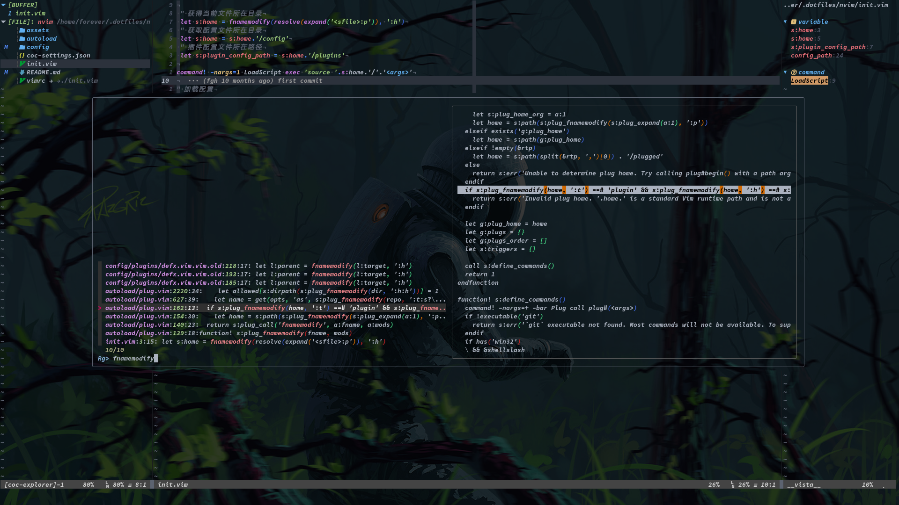

# vime

## About

该项目使用分离配置文件的方式，一个插件对应一个配置文件，方便插件的增删，同时也方便插件配置文件的移植。

将需要安装的插件写到`config/plug.vim`中，然后在`config/plugins`目录下建立与插件同名的配置文件，在该文件中写入自己的配置即可，如果要删除插件，只需要从`config/plug.vim`中删除插件条目即可，`config/plugins`目录下的同名配置文件不再加载，可以不用删除。



### 整体结构

```bash
├── coc-settings.json
├── config/
   ├── base.vim
   ├── keymap.vim
   ├── plugins/
   ├── config.vim
   ├── plug.vim
   └── theme.vim
├── init.vim
└── vimrc -> ./init.vim
```

简单了解下整个结构，我用的插件管理器是[junegunn/*vim*-*plug*](https://github.com/junegunn/vim-plug)。

目录结构：

1. `plug.vim`文件就是`vim-plug`的插件配置文件，里面是我们需要的插件列表，写在这里面的插件会加载他的配置，插件的配置在`plugins`目录下，一个插件对应一个文件。注释掉的插件不会加载其配置。
2. `base.vim`用于基础配置
3. `keymap.vim`用于按键映射
4. `theme.vim`用于主题配置
5. `plugins`目录下是所有插件的配置文件，一个插件一个配置文件，只会加载`plug.vim`中安装的插件的配置。
6. `config.vim`用于一些个人配置或全局配置，比如插件的缓存目录，笔记的根目录等

### 简单了解

1. 补全使用的是[neoclide/*coc*.*nvim*](https://github.com/neoclide/coc.nvim)
2. 文件管理使用的是[weirongxu/*coc*-explorer](https://github.com/weirongxu/coc-explorer)
3. 函数浏览器使用的是[liuchengxu/*vista*.*vim*](https://github.com/liuchengxu/vista.vim)

### 依赖

需要安装如下软件：

1. nodejs，npm：必装
2. ripgrep：必装，用于文件内容检索
3. neovim-remote:：可选，vimtex会用到，但是也可以不用，安装体验更好，`pip install neovim-remote`
4. clangd：可选，用于c系补全

### 安装

```bash
git clone https://github.com/fgheng/vime -C .config/nvim
```

然后打开neovim，执行`:PlugInstall`等待插件安装完毕即可！

### 快捷键

不管您选择了哪种补全插件，哪种检索插件，我们的快捷键配置都会尽可能保持一致，无须更改您的使用习惯，改变的只是`neo/vim`表现形式。

#### 补全行为

补全使用的[neoclide/*coc.nvim*](https://github.com/neoclide/coc.nvim)插件，该项目中也有[ycm-core/*YouCompleteMe*](https://github.com/ycm-core/YouCompleteMe)的配置，但最近主要使用coc，故ycm的配置已经很久不更新了。

| 按键      | 描述                                                         | 提供者 |
| --------- | ------------------------------------------------------------ | ------ |
| tab       | 1. 如果存在下拉框，那么选择下一个<br>2. 如果不存在下拉框，那么强制显示下拉框，前提是有内容显示，否则输入tab | coc    |
| shift-tab | 如果存在下拉框的话，选择下拉框的上一个                       | coc    |
| enter     | 选中下拉框中的该条目，如果条目可以扩展，那么将会扩展         | coc    |
| gd        | 跳转到定义                                                   | coc    |
| gr        | 跳转到引用                                                   | coc    |
| gi        | 跳转到实现                                                   | coc    |
| gy        | 跳转到类型定义                                               | coc    |
| alt-j     | 1. 正常模式下，跳转到下一处错误<br>2. 存在下拉框，选择下一个条目<br>3. 存在snippet，跳转到下一处补全处 | coc    |
| alt-k     | 同alt-j行为相反                                              | coc    |
| K         | 查看当前光标下函数的帮助                                     | coc    |
| \<space>k | 查看当前光标下函数的参数帮助                                 | coc    |

| 按键      | 描述                    | 提供者 |
| --------- | ----------------------- | ------ |
| \<space>l | 打开coclist             | coc    |
| \<space>a | 打开coclist dialogistic | coc    |
| \<space>c | 打开coclist command     | coc    |
| \<space>o | 打开coclist outline     | coc    |
| \<space>O | 打开coclist symbols     | coc    |
|           |                         |        |

#### 窗口与tab

| 按键           | 描述                                                         | 提供者         |
| -------------- | ------------------------------------------------------------ | -------------- |
| ctrl-w-h/j/k/l | 分别在当前窗口的左/下/上/右侧打开一个新的窗口，并将光标移动到新的窗口 |                |
| ctrl-h/j/k/l   | 分别移动光标到当前窗口的左/下/上/右侧窗口                    |                |
| alt-H/J/K/L    | 分别移动光标到当前窗口的左/下/上/右侧窗口                    |                |
| ctrl-w-o       | 最大化当前窗口，再按一次恢复                                 | zoomwintab.vim |
| -              | 选择窗口<br>交换窗口                                         | vim-choosewin  |
| alt-q          | 关闭窗口                                                     |                |
| alt-{          | 更改窗口宽度                                                 |                |
| alt-}          | 更改窗口宽度                                                 |                |
| \<leader>tn    | 在后面新建一个tab                                            |                |
| \<leader>tN    | 在前面新建一个tab                                            |                |
| \<leader>tc    | 关闭一个tab                                                  |                |
| alt-h/l        | 切换到上一个/下一个tab                                       |                |

#### 文件管理

文件管理使用的插件是[weirongxu/*coc*-*explorer*](https://github.com/weirongxu/coc-explorer)、[Shougo/*defx*.nvim](https://github.com/Shougo/defx.nvim)，两者之一，需要在`plug.vim`中选择，快捷键行为基本一致。支持浮动窗口。

同时可以使用\<leader>f打开ranger。

| 按键  | 描述                                          |
| ----- | --------------------------------------------- |
| j     | 下一个                                        |
| k     | 上一个                                        |
| h     | 收起目录                                      |
| l     | 展开目录/打开文件                             |
| H     | 递归收起目录                                  |
| L     | 递归打开目录                                  |
| J     | 跳到下一个可以展开的地方                      |
| K     | 跳到上一个可以展开的地方                      |
| enter | 进入目录并切换工作目录为进入的目录            |
| back  | 跳到上一级目并切换工作目录为切换的目录        |
| r     | 刷新目录                                      |
| v     | 选中/取消选中，并向下移动                     |
| V     | 选中/取消选中，并向上移动                     |
| *     | 选中/取消选中                                 |
| sh    | 水平打开                                      |
| sv    | 垂直打开                                      |
| st    | 新tab中打开                                   |
|       |                                               |
| dd    | 剪切文件                                      |
| Y     | 复制文件                                      |
| D     | 删除文件                                      |
| P     | 粘贴文件                                      |
| R     | 重命名文件                                    |
| A     | 添加文件或者目录，如果最后有`/`则表示添加目录 |
| yy    | 复制文件路径                                  |
| y     | 复制文件名称                                  |
| .     | 显示/关闭隐藏文件                             |
|       |                                               |
| x     | 使用系统应用打开文件                          |
| f     | 搜索文件                                      |
| F     | 递归搜索文件                                  |
|       |                                               |

#### buffer与文件检索等

该操作主要由[junegunn/*fzf*.vim](https://github.com/junegunn/fzf.vim)、[Yggdroot/*LeaderF*](https://github.com/Yggdroot/LeaderF)、[neoclide/*coc*.*nvim*](https://github.com/neoclide/coc.nvim)、[liuchengxu/*vim*-*clap*](https://github.com/liuchengxu/vim-clap)中的一个完成，快捷键基本一致，主要看`plug.vim`中选择的是哪一个插件，其中[neoclide/*coc*.*nvim*](https://github.com/neoclide/coc.nvim)优先级最低，有其他插件，那么就会覆盖掉coc的操作。

| 按键  | 描述                                                         | 提供者               |
| ----- | ------------------------------------------------------------ | -------------------- |
| alt-r | 最近打开的文件                                               | fzf/leaderf/clap/coc |
| alt-b | 显示当前打开的所有buffer                                     | fzf/leaderf/clap/coc |
| alt-f | 1. 搜索工程目录下的文件<br>2. 搜索wiki笔记目录下的文件       | fzf/leaderf/clap/coc |
| alt-F | 搜索HOME下的所有文件                                         | fzf/leaderf/clap/coc |
| alt-w | 显示打开的窗口                                               | fzf/leaderf/clap/coc |
| alt-m | 显示所有的标记                                               | fzf/clap/coc         |
| alt-M | 显示所有映射                                                 | fzf/clap/coc         |
| alt-s | 1. 使用rg搜索当前工程下的文件内容<br>2. 使用rg搜索wiki笔记目录下的内容 | fzf/leaderf/clap/coc |
| alt-c | 显示所有命令                                                 | fzf/leaderf/clap/coc |
| ？    | 模糊搜索所有打开的buffer的内容                               | fzf/leaderf/clap/coc |
| alt-y | 显示复制内容                                                 | clap/coc             |
| alt-g | 显示未提交的file列表                                         | fzf/clap             |
| alt-G | 显示所有提交的file列表                                       | fzf/clap/coc         |


#### 多光标

多光标使用的是插件[vim-visual-multi](https://github.com/mg979/vim-visual-multi)以及coc自带的多光标，如果`plug.vim`中没有[vim-visual-multi](https://github.com/mg979/vim-visual-multi)那么会使用coc自带的插件，coc行为与前者类似，但是功能不如前者多。

| 按键         | 模式              | 描述                                                         |
| ------------ | ----------------- | ------------------------------------------------------------ |
| tab          | visual-multi-mode | 在多光标模式下，使用tab可以更改光标模式                      |
| ctrl-c       | normal            | 在当前位置插入一个光标                                       |
| ctrl-down/up | normal            | 在当前位置下方/上方插入光标                                  |
| ctrl-s       | normal/visual     | 1. 选中当前光标下的所有单词<br>2. visual模式下选中所有的当前选中的内容 |
| ctrl-n       | normal            | 在visual模式下选中内容之后，按下ctrl-n会在下一处与当前选中内一样的地方插入光标。非visual模式下，与ctrl-s表现差不多，不过是依次选择当前光标下的单词。 |
| q            | visual-multi-mode | 取消当前位置插入的光标，并跳到下一个匹配位置                 |
|              | visual-multi-mode | 取消当前选中的区域                                           |
| ]/[          | visual-multi-mode | 在多个选中的光标之间进行跳转                                 |
| n            | visual-multi-mode | 跳到下一个匹配的模式，不选中                                 |
| S            | visual-multi-mode | 在多光标模式下，将多个选中的内容以某种符号进行进行包围       |
| o            | visual-multi-mode | 交换光标位置                                                 |
| m            |                   |                                                              |
| \\\/         | normal            | 以正则匹配的方式设置多光标                                   |

#### 注释

注释插件使用[nerdcomment](https://github.com/preservim/nerdcommenter)。

| 按键               | 模式          | 描述                                       |
| ------------------ | ------------- | ------------------------------------------ |
| \<leader>cs        | normal/visual | 用一种比较好看的方式注释当前行或选中的内容 |
| \<leader>ci        | normal/visual | 注释/取消注释                              |
| \<leader>cm        | normal/visual | 用一种最简单的方式注释当前行或选中的内容   |
| \<leader>cl        | normal/visual | 按行的方式注释选中的内容                   |
| \<leader>cb        | normal/visual | 注释选中的内容                             |
| \<leader>cu        | normal/visual | 取消注释选中的内容                         |
| \<leader>ca        | normal        | 切换到另一种注释符号                       |
|                    |               |                                            |
| \<leader>cA        | normal        | 在当前行最后增加注释符号并进入插入模式     |
| \<leader>c$        | normal        | 从当前光标处注释到当前行的最后             |
| \<leader>c\<space> |               |                                            |
| \<leader>cc        |               |                                            |
| \<leader>cn        |               |                                            |

#### 终端

终端使用的是[voldikss/vim-*floaterm*](https://github.com/voldikss/vim-floaterm)

| 按键  | 模式           | 描述              |
| ----- | -------------- | ----------------- |
| alt = | normal         | 打开/关闭当前终端 |
| alt + | normal/tnormal | 新建一个终端      |
| alt h | tnormal        | 切换到上一个终端  |
| alt l | tnormal        | 切换到下一个终端  |

#### 代码折叠

代码折叠使用的插件是[pseewald/vim-*anyfold*](https://github.com/pseewald/vim-anyfold)

| 按键 | 模式   | 描述                 |
| ---- | ------ | -------------------- |
| zc   | normal | 折叠                 |
| zC   | normal | 循环折叠             |
| zo   | normal | 打开折叠             |
| zO   | normal | 循环打开折叠         |
| zc   | normal | 打开折叠或者关闭折叠 |
| zA   | normal | za的循环             |
| zm   | normal | 折起更多             |
| zM   | normal | 折起所有             |
| zr   | normal | 减少折叠             |
|      | normal | 打开所有折叠         |

#### 笔记

笔记使用的是插件[vimwiki/*vimwiki*](https://github.com/vimwiki/vimwiki)，可以记笔记可以写日记，支持markdown。

可以使用[junegunn/*fzf.vim*](https://github.com/junegunn/fzf.vim)、[Yggdroot/*LeaderF*](https://github.com/Yggdroot/LeaderF)进行笔记文件和笔记内容的搜索。


| 按键                 | 模式    | 描述                       |
| -------------------- | ------- | -------------------------- |
| 笔记                 |         |                            |
| alt s                | normal  | 搜索vimwiki中的内容        |
| \<leader>ww          | normal  | 打开vimwiki                |
| \<leader>wt          | normal  | 在新的tab打开vimwiki       |
| \<leader>wd          | normal  | 删除当前page               |
| \<leader>wr          | normal  | 重命名当前的page           |
| 日记                 |         |                            |
| \<leader>wi          |         | 打开日记列表               |
| \<leader>w\<leader>i |         | 更新当前的日记列表         |
| \<leader>w\<leader>w |         | 打开今天的日记             |
| \<leader>w\<leader>t |         | 在新的tab中打开今天的日记  |
| ctrl up/down         |         | 打开昨天/明天的日记        |
| 导航                 |         |                            |
| enter                |         | 创建链接                   |
| ctrl shift enter     |         |                            |
| back                 |         | 回到上一级目录             |
| tab                  |         | 跳转到下一处链接           |
| shift tab            |         | 跳转到上一处链接           |
| 编辑快捷键           |         |                            |
| =                    |         | 增加标题                   |
| -                    |         | 减少标题                   |
| +                    |         | 创建链接                   |
| glm                  |         | 增加list item的缩进        |
| gll                  |         | 减少list item的缩进        |
| gl* 或 gl8           |         | 将该行变为*条目            |
| gl# 或 gl3           |         | 将该行变为#                |
| gl-                  |         | 将该行变为-                |
| gl1                  |         | 将改行变为1.               |
| 表格模式             |         |                            |
| cr                   | insert  | 插入模式                   |
| tab                  | instert | 插入模式，跳到下一个输入框 |
| gqq 或 gww           | normal  | 格式化表格                 |
|                      |         |                            |

#### Surround

Surround是使用快捷键来给指定的字符串添加包围，比如引号等。使用的插件是[tpope/*vim*-*surround*](https://github.com/tpope/vim-surround)

| 按键      | 模式   | 描述                                             |
| --------- | ------ | ------------------------------------------------ |
| cs"''     | normal | changed surround "' 将双引号改为单引号           |
| cs'\<q>   | normal | 将单引号改变为\<q>包围                           |
| cst"      | normal | 将tag改变为双引号，比如\<q>hello\</q>变为"hello" |
| ds"       | normal | 删除双引号                                       |
| ysiw]     | normal | iw是选择一个单词，在选中的单词处增加中括号       |
| ysiw[     | normal | 同上，不过两侧会增加空格                         |
| yss)      | normal | 整行增加括号                                     |
| ysiw\<em> | normal | 在一个单词处增加\<em>\</em>包围                  |

#### Git

git插件可以选择使用[airblade/vim-*gitgutter*](https://github.com/airblade/vim-gitgutter)、[tpope/vim-*fugitive*](https://github.com/tpope/vim-fugitive)、[neoclide/*coc-git*](https://github.com/neoclide/coc-git)

| 按键            | 模式    | 描述                       | 提供者|
| ------------------ | ------- | -------------------------- |--------|
| gf             | normal | 折叠/打开未改变的行 | gitgutter |
| gk | normal | 跳转到上一个修改地方 | coc-git |
| gj | normal | 跳转到下一个修改地方 | coc-git |
| gp | normal | 浮动预览光标处的修改 | coc-git |
| gu | normal | 撤销光标处相对于上次提交的修改 | coc-git |
| gb | normal | 打开/关闭 blame | fugitive |
| gs | normal | git different split | fugitive |
| gm   | normal | 查看当前文件的commits          | fzf/coc-git |
| gM   | normal | 查看所有的commits              | fzf/coc-git |
| gc   | normal | git commit                     | fugitive  |
| gw | normal | 写入，相当于git add | fugitive |


#### 数据库

数据库可以选择使用[tpope/vim-*dadbod*](https://github.com/tpope/vim-dadbod)

#### 绘图

绘图使用[vim-scripts/*DrawIt*](https://github.com/vim-scripts/DrawIt)，命令行输入`DrawIt`进入绘图模式。

#### Latex

latex可以选择使用[lervag/*vimtex*](https://github.com/lervag/vimtex)

#### Debug

debug可以选择使用[puremourning/*vimspector*](https://github.com/puremourning/vimspector)

#### Run

#### 翻译

