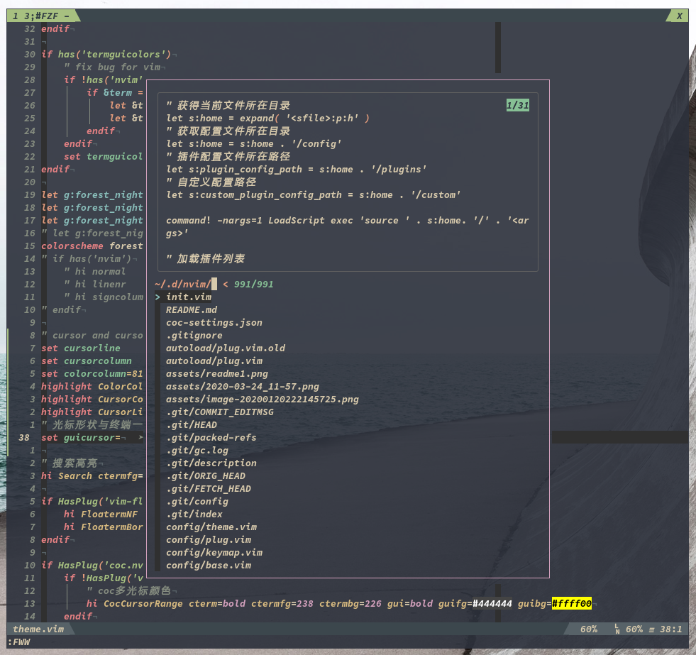

# vime



vime是一个结构化的(neo)vim配置，具有如下优势：

1. 结构简单明了。该项目中每个插件都单独对应一个配置文件，插件列表`config/plugin_list.vim`可以控制所要加载的插件以及该插件配置。
2. 增删配置容易。大家可以根据自己的需求，快速的增减插件。
3. 低耦合性。大家可以将某一个插件的配置文件单独拿出来放到自己的(neo)vim配置中直接使用。

一些截图和GIF，欢迎各位提供：

1. [点击查看截图](https://github.com/fgheng/vime/issues/7)
2. [点击查看GIF](https://github.com/fgheng/vime/issues/8)

## 目录

<!-- vim-markdown-toc GFM -->

* [整体结构](#整体结构)
* [安装](#安装)
    - [依赖](#依赖)
    - [安装](#安装-1)
* [插件结构](#插件结构)
* [插件以及快捷键](#插件以及快捷键)
    - [补全](#补全)
        + [可选插件](#可选插件)
        + [快捷键](#快捷键)
    - [文件管理](#文件管理)
        + [可选插件](#可选插件-1)
        + [快捷键](#快捷键-1)
    - [快速检索](#快速检索)
        + [可选插件](#可选插件-2)
        + [快捷键](#快捷键-2)
    - [基础快捷键](#基础快捷键)
        + [快捷键](#快捷键-3)
    - [Git](#git)
        + [可选插件](#可选插件-3)
        + [快捷键](#快捷键-4)
    - [多光标](#多光标)
        + [可选插件](#可选插件-4)
        + [快捷键](#快捷键-5)
    - [快速跳转](#快速跳转)
        + [可选插件](#可选插件-5)
        + [快捷键](#快捷键-6)
    - [注释与文档](#注释与文档)
        + [可选插件](#可选插件-6)
        + [快捷键](#快捷键-7)
    - [终端](#终端)
        + [可选插件](#可选插件-7)
        + [快捷键](#快捷键-8)
    - [代码折叠](#代码折叠)
        + [可选插件](#可选插件-8)
        + [快捷键](#快捷键-9)
    - [笔记](#笔记)
        + [可选插件](#可选插件-9)
        + [快捷键](#快捷键-10)
    - [Latex](#latex)
        + [可选插件](#可选插件-10)
        + [快捷键](#快捷键-11)
        + [其他](#其他)
    - [tmux](#tmux)
        + [可选插件](#可选插件-11)
    - [书签](#书签)
        + [可选插件](#可选插件-12)
        + [快捷键](#快捷键-12)
    - [session](#session)
    - [Surround](#surround)
        + [可选插件](#可选插件-13)
        + [快捷键](#快捷键-13)
    - [数据库](#数据库)
    - [绘图](#绘图)
    - [Debug](#debug)
    - [Run](#run)
    - [翻译](#翻译)
    - [其他](#其他-1)
* [TODO](#todo)

<!-- vim-markdown-toc -->

## 整体结构

```bash
├── autoload/
│   ├── common/
│   │   ├── common.vim
│   │   └── functions.vim
├── config/
│   ├── plugins/
│   ├── other/
│   ├── theme/
│   │   ├── theme.vim
│   │   ├── statusline.vim
│   │   └── tabline.vim
│   ├── base.vim
│   ├── keymap.vim
│   └── plugin_list.vim
├── plugin/
├── ftplugin/
├── scripts/
├── init.vim
└── vimrc -> ./init.vim
```

**下面简单介绍下整个结构：**

1. `autoload/`

   在(neo)vim中，`autoload/`目录用于自动加载。我将全局变量以及全局函数放到了`autoload/common/`目录下的`common.vim`和`functions.vim`文件中，如果大家想单独复制一个插件的配置到自己的(neo)vim配置中，那么请不要忘记将这些全局变量复制过去，因为很多插件配置都用到了这里的全局变量或者全局函数。

3. `config/`

   该目录是主要的配置文件目录。

   - `config/plugins/`

     此目录下面就是所有插件的配置，一个插件对应一个文件，文件的名称与插件的名称相同，比如插件`Plug "user_name/plugin_name.vim"`对应的配置文件名称为`plugin_name.vim.vim`。

     对于插件的配置文件，有一个小小的规范，某个插件的按键映射最好写到对应配置文件的最后。

   - `config/other/`

     此目录主要存放一些插件需要用到的文件，比如插件[coc](https://github.com/neoclide/coc.nvim)用到的`coc-settings.json`，ycm用到的`ycm_extra_conf.py`等文件。

   - `config/theme/`

     主题配置，(neo)vim主题相关的配置基本上都放到该文件夹下。

   - `config/plugin_list.vim`

     此文件是插件列表文件，想要使用什么插件都写到此文件中。(neo)vim在启动的时候会依据该文件所列插件自动加载对应的配置文件。

   - `base.vim`

     基础配置。

   - `keymap.vim`

     此文件是一些快捷键配置，通常这些快捷键与插件无关，与插件相关的快捷键一般都放到插件的配置文件中。

3. `plugin/`

   在(neo)vim中，`plugin/`目录下的配置会在(neo)vim启动的时候自动加载，因此，我主要用于存放一些自定义的配置在这里。


4. `ftplugin`

   该目录是(neo)vim的目录，该目录下的文件都是以`文件类型.vim`格式进行命名，比如`c.vim`，`cpp.vim`，表示遇到`c`，`cpp`文件的时候要执行对应文件的代码。

5. `scripts/`

   该目录主要存储一些常用的脚本文件，如`preview.sh`等。

6. `init.vim`

   (neo)vim初始化时要读取的文件。

7. `vimrc`

   (neo)vim初始化时要读取的文件，该文件链接到`init.vim`。

## 安装

### 依赖

下面是一些必须或者可选的一些依赖：

1. `neovim`

   此处的`neovim`是指python包中`neovim`，通过`pip install neovim`进行安装，必须安装。

2. `ripgrep`

   该软件主要用于`fzf`、`clap`、`leaderf`等插件，主要用于内容检索，建议安装。

3. `nodejs`、`npm`

   该软件主要用于[coc](https://github.com/neoclide/coc.nvim)补全插件，如果使用coc则必须安装。

4. `neovim-remote`、`xdotool`、`inkscape`、`rofi`、`pip install inkscape-figures`

   这些软件主要用于[vimtex](https://github.com/lervag/vimtex)插件，写latex的用户可能会用到。

   其中xdotool主要用于在预览软件中按下ctrl+鼠标左键定位到代码位置，inkscape、rofi、inkscape-figures三个软件主要用于使用inkscape绘图然后自动插入到latex中，主要参考[inkscape-figures](https://github.com/gillescastel/inkscape-figures)。

5. `zathura`

   该软件是pdf阅读器，同样主要用于[vimtex](https://github.com/lervag/vimtex)插件，主要是用来进行预览，可选。

### 安装

```bash
git clone https://github.com/fgheng/vime ~/.config/nvim
```

然后打开(neo)vim，执行`:PlugInstall`等待插件安装完毕即可！

**注意：**

1. 因为一开始没有安装主题，因此在第一次启动的时候可能会提示找不到主题，属于正常现象，执行完`:PlugInstall`之后再打开(neo)vim即可。
2. 因为列表中有关于`tmux`的插件，而这些插件只有在`tmux`中打开(neo)vim的时候才会加入到插件列表中，因此，第一次运行vime的时候如果没有启动`tmux`，那么这些关于`tmux`的插件将不会安装，要安装这些插件需要在`tmux`中打开(neo)vim后重新执行`PlugInstall`命令才可以。
3. 第一次安装可能要等待很长时间，可以稍微耐心等待一下。


## 插件结构

此部分主要介绍`vime`的插件结构。

所有用到的插件都在`config/plugin_list.vim`中，该文件中的内容如下：

```viml
Plug 'neoclide/coc.nvim', { 'branch': 'release' }
Plug 'junegunn/fzf.vim'
Plug 'junegunn/fzf', { 'do': {-> fzf#install()} }
Plug 'antoinemadec/coc-fzf',  {'branch': 'release'}
```

需要什么插件，就在这里添加。

当需要为自己使用的插件自定义配置的时候，请按照如下的例子进行：

以`Plug 'juegunn/fzf.vim'`为例，首先我们要在`config/plugin_list.vim`中添加一行`Plug 'juegunn/fzf.vim'`，表示我们要安装该插件，接下来要为该插件自定义配置，那么需要在`config/plugins/`目录下建立与插件名同名的文件`fzf.vim.vim`，注意后缀`.vim`，最后在该文件中编写关于该插件的配置即可。

如果不想使用该插件了，那么只需要在`config/plugin_list.vim`中注释掉该插件，`config/plugins/fzf.vim.vim`文件则不必删除，(neo)vim在启动的时候将不再加载该配置文件。


## 插件以及快捷键

下面介绍的是我常用的插件及其快捷键，当然，我会先按照类型进行介绍，同一个类型下可能会有很多插件（一般选择自己喜欢的那个），而我的配置中，同一个类型的插件的快捷键我都尽可能配置的一样，这样，在更换为另一个插件的时候，更改的只有(neo)vim的表现形式而不会改变我们的使用习惯。

### 补全

#### 可选插件

对于补全，有很多插件，而我常用的是两个，一个是[coc](https://github.com/neoclide/coc.nvim)，另一个是[YouCompleteMe](https://github.com/ycm-core/YouCompleteMe)，两者都属于补全类的插件，因此，两者的快捷键应该一致。

1. 使用[coc](https://github.com/neoclide/coc.nvim)

   ```viml
   Plug 'neoclide/coc.nvim', { 'branch': 'release' }
   ```

2. 使用[YouCompleteMe](https://github.com/ycm-core/YouCompleteMe)

   ```viml
   Plug 'ycm-core/YouCompleteMe', {'do': 'python3 install.py --all'}
   ```

#### 快捷键

| 按键       | 描述                                                         | 提供者  |
| ---------- | ------------------------------------------------------------ | ------- |
| tab        | 1. 如果存在下拉框，那么选择下一个<br>2. 如果不存在下拉框，那么强制显示下拉框，前提是有内容显示，否则输入tab | coc     |
| shift-tab  | 如果存在下拉框的话，选择下拉框的上一个                       | coc/ycm |
| enter      | 选中下拉框中的该条目，如果条目可以扩展，那么将会扩展         | coc/ycm |
| gd         | 跳转到定义                                                   | coc/ycm |
| gr         | 跳转到引用                                                   | coc/ycm |
| gi         | 跳转到实现                                                   | coc/ycm |
| gy         | 跳转到类型定义                                               | coc/ycm |
| alt-j      | 1. normal模式下，跳转到下一处错误<br>2. instert模式下，如果存在下拉框，选择下一个条目<br>3. instert模式下，如果存在snippet跳转块，跳转到下一处补全处 | coc     |
| alt-k      | 同alt-j行为相反                                              | coc     |
| K          | 查看当前光标下函数的帮助                                     | coc/ycm |
| \<space>k  | 查看当前光标下函数的参数帮助                                 | coc     |
| \<space>rn | 重命名变量、函数名称等                                       | coc/ycm |
| \<space>f  | 按照lsp的建议对代码错误进行自动修复                          | coc/ycm |

下面是coc插件的额外快捷键

| 按键      | 描述                    | 提供者 |
| --------- | ----------------------- | ------ |
| \<space>l | 打开coclist             | coc    |
| \<space>a | 打开coclist dialogistic | coc    |
| \<space>c | 打开coclist command     | coc    |
| \<space>o | 打开coclist outline     | coc    |
| \<space>O | 打开coclist symbols     | coc    |
|           |                         |        |

### 文件管理

#### 可选插件

[weirongxu/*coc*-*explorer*](https://github.com/weirongxu/coc-explorer)、[Shougo/*defx*.nvim](https://github.com/Shougo/defx.nvim)、[nerdtree](https://github.com/preservim/nerdtree)、[ms-jpq/*chadtree*](https://github.com/ms-jpq/chadtree)

1. 使用coc-explorer

   在`config/plugin_list.vim`中

   ```viml
   let g:coc_global_extensions = ['coc-explorer']
   ```

2. 使用defx

   ```viml
   if has('nvim')
     Plug 'Shougo/defx.nvim', { 'do': ':UpdateRemotePlugins' }
     Plug 'kristijanhusak/defx-icons'
     Plug 'kristijanhusak/defx-git'
   else
     Plug 'Shougo/defx.nvim'
     Plug 'roxma/nvim-yarp'
     Plug 'roxma/vim-hug-neovim-rpc'
     Plug 'kristijanhusak/defx-icons'
     Plug 'kristijanhusak/defx-git'
   endif
   ```

3. 使用nerdtree

   ```viml
   Plug 'preservim/nerdtree'
   Plug 'Xuyuanp/nerdtree-git-plugin'
   ```

4. 使用chadtree

   ```viml
   Plug 'ms-jpq/chadtree', {'branch': 'chad', 'do': ':UpdateRemotePlugins'}
   ```

#### 快捷键

| 按键       | 描述                                          | 提供者                      |
| ---------- | --------------------------------------------- | --------------------------- |
| j          | 下一个                                        | coc-explorer/nerdtree/defx  |
| k          | 上一个                                        | coc-explorer/nerdtree/defx  |
| h          | 收起目录或跳到上级目录                        | coc-explorer/nerdtree/defx  |
| l          | 展开目录/打开文件                             | coc-explorer/nerdtree/defx  |
| H          | 递归收起目录                                  | coc-explorer                |
| L          | 递归打开目录                                  | coc-explorer/nerdtree/defx  |
| J          | 跳到下一个可以展开的地方                      | coc-explorer/               |
| K          | 跳到上一个可以展开的地方                      | coc-explorer/               |
| enter      | 进入目录并切换工作目录为进入的目录            | coc-explorer/nerdtree/defx/ |
| backspace  | 跳到上一级目并切换工作目录为切换的目录        | coc-explorer/nerdtree/defx/ |
| r          | 刷新目录                                      | coc-explorer/nerdtree/defx/ |
| v          | 选中/取消选中，并向下移动                     | coc-explorer/defx/          |
| V          | 选中/取消选中，并向上移动                     | coc-explorer/defx/          |
| *          | 选中/取消选中                                 | coc-explorer/defx/          |
| w          | 水平打开                                      | coc-explorer/nerdtree/defx/ |
| W          | 垂直打开                                      | coc-explorer/nerdtree/defx/ |
| t          | 新tab中打开                                   | coc-explorer/nerdtree/defx/ |
|            |                                               |                             |
| dd         | 剪切文件                                      | coc-explorer/defx/          |
| Y          | 复制文件                                      | coc-explorer/defx/          |
| D          | 删除文件                                      | coc-explorer/defx/          |
| P          | 粘贴文件                                      | coc-explorer/defx/          |
| R          | 重命名文件                                    | coc-explorer/defx/          |
| N          | 添加文件或者目录，如果最后有`/`则表示添加目录 | coc-explorer/defx/          |
| yp         | 复制文件路径                                  | coc-explorer/defx/          |
| yn         | 复制文件名称                                  | coc-explorer/               |
| .          | 显示/关闭隐藏文件                             | coc-explorer/nerdtree/defx/ |
|            |                                               | coc-explorer/nerdtree/defx/ |
| x          | 使用系统默认应用打开文件                      | coc-explorer/defx/          |
| f          | 搜索文件                                      | coc-explorer                |
| F          | 递归搜索文件                                  | coc-explorer                |
|            |                                               |                             |
| \<leader>f | 悬浮或者在当前窗口打开                        | coc-explorer/defx/          |
|            |                                               |                             |

### 快速检索

#### 可选插件

[junegunn/*fzf*.vim](https://github.com/junegunn/fzf.vim)、[Yggdroot/*LeaderF*](https://github.com/Yggdroot/LeaderF)、[liuchengxu/*vim*-*clap*](https://github.com/liuchengxu/vim-clap)、coc-lists，其中如果存在前面的三个插件之一，那么coc-lists优先级最低。

1. 使用fzf

   ```viml
   Plug 'junegunn/fzf.vim'
   Plug 'junegunn/fzf', { 'do': {-> fzf#install()} }
   Plug 'antoinemadec/coc-fzf',  {'branch': 'release'}
   ```

2. 使用LeaderF

   ```viml
   Plug 'Yggdroot/LeaderF'
   ```

3. 使用vim-clap

   ```viml
   Plug 'liuchengxu/vim-clap', { 'do': ':Clap install-binary!' }
   Plug 'vn-ki/coc-clap'
   ```

4. 使用coc-lists

   ```viml
   let g:coc_global_extensions = ['coc-lists']
   ```

#### 快捷键

| 按键  | 描述                                                         | 提供者                                   |
| ----- | ------------------------------------------------------------ | ---------------------------------------- |
| alt-r | 最近打开的文件                                               | fzf/leaderf/clap/coc                     |
| alt-b | 显示当前打开的所有buffer                                     | fzf/leaderf/clap/coc                     |
| alt-f | 1. 搜索工程目录下的文件<br>2. 搜索wiki笔记目录下的文件       | fzf/leaderf/clap/coc                     |
| alt-F | 搜索HOME下的所有文件                                         | fzf<br>因为clap很慢所以只有fzf保存该功能 |
| alt-w | 显示打开的窗口                                               | fzf/leaderf/clap/coc                     |
| alt-m | 显示所有的标记，即marks                                      | fzf/clap/coc                             |
| alt-M | 显示所有映射                                                 | fzf/clap/coc                             |
| alt-s | 1. 使用rg搜索当前工程下的文件内容<br>2. 如果正在编辑wiki目录下的笔记，那么使用rg会搜索wiki笔记目录下的内容<br>3.visural模式下选中内容之后会自动搜索选中的内容 | fzf/leaderf/clap/coc                     |
| alt-c | 显示所有命令                                                 | fzf/leaderf/clap/coc                     |
| ？    | 模糊搜索所有打开的buffer的内容                               | fzf/leaderf/clap/coc                     |
| alt-y | 显示复制内容                                                 | fzf/clap/coc                             |
| alt-J | 显示跳转                                                     | fzf/clap                                 |
| alt-x | 使用系统默认应用打开检索到的文件                             | fzf                                      |
| \<F8> | quickfix                                                     | fzf/clap                                 |
| \<F9> | locationList                                                 | fzf/clap                                 |
|       |                                                              |                                          |

### 基础快捷键

这些快捷键主要是操作窗口与buf的。

#### 快捷键

| 按键           | 描述                                                         | 提供者        |
| -------------- | ------------------------------------------------------------ | ------------- |
|                |                                                              |               |
| ctrl-w-h/j/k/l | 分别在当前窗口的左/下/上/右侧打开一个**新的窗口**            |               |
| ctrl-h/j/k/l   | 分别移动光标到当前窗口的左/下/上/右侧窗口                    |               |
| ctrl-w-o       | 最大化当前窗口，再按一次恢复                                 |               |
| -              | 选择窗口<br>交换窗口（按下-后在按s即可交换窗口）             | vim-choosewin |
| q              | 关闭窗口                                                     |               |
| alt (          | 窗口左右方向变小                                             |               |
| alt )          | 窗口左右方向变大                                             |               |
| alt -          | 窗口上下方向变小，注意是减号                                 |               |
| alt _          | 窗口上下方向变大，注意是下划线                               |               |
|                |                                                              |               |
| \<leader>q     | 使用宏                                                       |               |
| jk             | 表示\<esc>                                                   |               |
| \<backspace>   | 取消搜索高亮                                                 |               |
|                |                                                              |               |
| ctrl h/j/k/l   | 插入模式下移动光标                                           |               |
| alt h l        | 插入模式下将光标移动到本行开头和结尾                         |               |
| alt o O        | 插入模式下在本上下或上新建一行                               |               |
|                |                                                              |               |
| \<leader>tn    | 在后面新建一个tab                                            |               |
| \<leader>tc    | 关闭一个tab                                                  |               |
| \<leader>tt    | 新建一个终端                                                 |               |
| alt-H/L        | 将当前的tab移动到左侧/右侧                                   |               |
| alt-h/l        | 切换到上一个/下一个tab<br>如果存在浮动终端，则切换为上一个或下一个浮动终端<br>如果不存在多个tab，那么切换上一个或下一个buffer |               |

### Git

#### 可选插件

git插件可以选择使用[airblade/vim-*gitgutter*](https://github.com/airblade/vim-gitgutter)、[tpope/vim-*fugitive*](https://github.com/tpope/vim-fugitive)、[neoclide/*coc-git*](https://github.com/neoclide/coc-git)

1. 使用vim-gitgutter

   ```viml
   Plug 'airblade/vim-gitgutter'
   ```

2. 使用vim-fugitive

   ```viml
   Plug 'vim-fugitive', {'on': ['Gwrite', 'Gcommit', 'Gread', 'Gdiff', 'Gblame']}
   ```

3. 使用coc-git

   ```viml
   let g:coc_global_extensions = ['coc-git']
   ```

#### 快捷键

| 按键        | 模式   | 描述                           | 提供者            |
| ----------- | ------ | ------------------------------ | ----------------- |
| \<leader>gk | normal | 跳转到上一个修改地方           | coc-git/gitgutter |
| \<leader>gj | normal | 跳转到下一个修改地方           | coc-git/gitgutter |
| \<leader>gp | normal | 浮动预览光标处的修改           | coc-git/gitgutter |
| \<leader>gu | normal | 撤销光标处相对于上次提交的修改 | coc-git/gitgutter |
| \<leader>gw | normal | 添加当前文件到index            | fugitive          |
| \<leader>gc | normal | 提交                           | fugitive          |
| \<leader>gf | normal | 查看差异                       | fugitive          |
| \<leader>gr | normal | 回复当前文件到上个版本         | fugitive          |
| \<leader>gb | normal | blame                          | fugitive          |
|             |        |                                |                   |

### 多光标

#### 可选插件

多光标使用的是插件[vim-visual-multi](https://github.com/mg979/vim-visual-multi)以及coc自带的多光标，如果`plug.vim`中没有[vim-visual-multi](https://github.com/mg979/vim-visual-multi)那么会使用coc自带的插件，coc行为与前者类似，但是功能不如前者多。

1. 使用vim-visual-multi

   ```viml
   Plug 'mg979/vim-visual-multi'
   ```

2. 使用coc自带多光标

   ```viml
   Plug 'neoclide/coc.nvim', { 'branch': 'release' }
   ```

#### 快捷键

| 按键             | 模式                  | 描述                                                         | 提供者           |
| ---------------- | --------------------- | ------------------------------------------------------------ | ---------------- |
| tab              | visual-multi-mode     | 光标和扩展模式直接切换                                       | vim-visual-multi |
| shift-左右方向键 | normal                | 选中区域并进入visual-multi-mode                              | vim-visual-multi |
| ctrl-c           | normal                | 在当前位置插入一个光标（然后使用上下左右键移动到指定未知添加下一个光标，hjkl键会移动添加的光标） | vim-visual-multi |
| ctrl-down/up     | normal                | 垂直方向插入多光标                                           | vim-visual-multi |
| ctrl-s           | normal/visual         | 1. 选中当前光标下的所有单词<br>2. visual模式下选中所有的当前选中的内容 | vim-visual-multi |
| ctrl-n/N         | normal                | 在visual模式下选中内容之后，按下ctrl-n会在下一处与当前选中内一样的地方插入光标。非visual模式下，与ctrl-s表现差不多，不过是依次选择当前光标下的单词。 | vim-visual-multi |
| q                | visual-multi-mode     | ~~取消当前位置插入的光标，并跳到下一个匹配位置~~<br>取消当前光标或者选中的区域 | vim-visual-multi |
| ~~Q~~            | ~~visual-multi-mode~~ | ~~取消当前的光标或者选中的区域~~                             | vim-visual-multi |
| ]/[              | visual-multi-mode     | 在多个选中的光标之间进行跳转                                 | vim-visual-multi |
| n/N              | visual-multi-mode     | 跳到下一个/上一个匹配的模式，可以代替]/[进行使用             | vim-visual-multi |
| S                | visual-multi-mode     | 在多光标模式下，将多个选中的内容以某种符号进行进行包围       | vim-visual-multi |
| o                | visual-multi-mode     | 交换光标位置                                                 | vim-visual-multi |
| m                |                       |                                                              | vim-visual-multi |
| \\\/             | normal                | 以正则匹配的方式设置多光标                                   | vim-visual-multi |
|                  |                       |                                                              |                  |

### 快速跳转

#### 可选插件

快速跳转使用的是[vim-easymotion](https://github.com/easymotion/vim-easymotion)或者[clever-f](https://github.com/rhysd/clever-f.vim)，easymotion中只使用了两个功能，一个是使用char进行跳转，另一个是跳转到行。

1. 选择vim-easymotion

   ```viml
   Plug 'easymotion/vim-easymotion'
   ```

2. 选择clever-f

   ```viml
   Plug 'rhysd/clever-f.vim'
   ```

#### 快捷键

| 按键 | 模式   | 描述                                                         | 提供者                  |
| ---- | ------ | ------------------------------------------------------------ | ----------------------- |
| f    | normal | 根据输入的char进行跳转，按下f后会提示要跳转到哪个char，<br>需要再输入一个char然后回车确认 | clever-f/vim-easymotion |
| gl   | normal | 跳转到行                                                     | vim-easymotion          |
| F    | normal | 直接根据单词跳转                                             | vim-easymotion          |


### 注释与文档

#### 可选插件

文档生成器使用[kkoomen/*vim*-*doge*](https://github.com/kkoomen/vim-doge)，注释插件使用[nerdcomment](https://github.com/preservim/nerdcommenter)或者[*tyru*/*caw*.*vim*](https://github.com/tyru/caw.vim)，caw功能没有nerdcomment多，但是简洁。

1. 使用vim-doge

   ```viml
   Plug 'kkoomen/vim-doge'
   ```

2. 使用nerdcomment

   ```viml
   Plug 'preservim/nerdcommenter'
   ```

3. 使用caw.vim

   ```viml
   Plug 'tyru/caw.vim'
   ```

#### 快捷键

| 按键       | 模式   | 描述         |
| ---------- | ------ | ------------ |
| \<leader>d | normal | 生成函数文档 |

caw快捷键

| 按键        | 模式         | 描述                     |
| ----------- | ------------ | ------------------------ |
| \<leader>cc | nomal/visual | 注释/取消注释            |
| \<leader>ci | nomal/visual | 在当前光标处加入注释     |
| \<leader>cI | nomal/visual | 在当前行的最开始加入注释 |
| \<leader>ca | nomal/visual | 在当前行最后加入注释     |
| \<leader>cw | nomal        | 给单词加注释             |
| \<leader>cb | nomal/visual | 给选中的区域弄一个块注释 |
| \<leader>co | nomal        | 在下一行加入注释         |
| \<leader>cO | nomal        | 在上一行加入注释         |

下面的是nerdcomment的快捷键

| 按键               | 模式          | 描述                                       |
| ------------------ | ------------- | ------------------------------------------ |
| \<leader>cc        | normal/visual | 注释                                       |
| \<leader>cu        | normal/visual | 取消注释选中的内容                         |
| \<leader>cs        | normal/visual | 用一种比较好看的方式注释当前行或选中的内容 |
| \<leader>ci        | normal/visual | 注释/取消注释                              |
| \<leader>cm        | normal/visual | 用一种最简单的方式注释当前行或选中的内容   |
| \<leader>cl        | normal/visual | 按行的方式注释选中的内容                   |
| \<leader>cb        | normal/visual | 注释选中的内容                             |
| \<leader>ca        | normal        | 切换到另一种注释符号                       |
|                    |               |                                            |
| \<leader>cA        | normal        | 在当前行最后增加注释符号并进入插入模式     |
| \<leader>c$        | normal        | 从当前光标处注释到当前行的最后             |
| \<leader>c\<space> |               |                                            |
|                    |               |                                            |
| \<leader>cn        |               |                                            |

### 终端

#### 可选插件

终端使用的是[voldikss/vim-*floaterm*](https://github.com/voldikss/vim-floaterm)

1. 使用vim-floaterm

   ```viml
   Plug 'voldikss/vim-floaterm'
   ```

#### 快捷键

| 按键  | 模式           | 描述                         |
| ----- | -------------- | ---------------------------- |
| alt = | normal         | 打开/关闭当前终端            |
| alt + | normal/tnormal | 新建一个终端                 |
| alt h | tnormal        | 打开终端后，切换到上一个终端 |
| alt l | tnormal        | 打开终端后，切换到下一个终端 |

### 代码折叠

#### 可选插件

代码折叠使用的插件是[pseewald/vim-*anyfold*](https://github.com/pseewald/vim-anyfold)

```viml
Plug 'pseewald/vim-anyfold'
```

#### 快捷键

| 按键     | 模式   | 描述                                                   |
| -------- | ------ | ------------------------------------------------------ |
| zc       | normal | 关闭光标下的折叠                                       |
| zC       | normal | 关闭光标下的折叠以及嵌套的折叠                         |
| zo       | normal | 打开光标下的折叠                                       |
| zO       | normal | 打开光标下的折叠以及嵌套的折叠                         |
| za       | normal | 光标下折叠若是关闭则打开若是打开则关闭                 |
| zA       | normal | 光标下折叠若是关闭则打开包括嵌套若是打开则关闭包括嵌套 |
| zm       | normal | 一层一层的关闭折叠                                     |
| zM       | normal | 关闭所有折叠                                           |
| zr       | normal | 一层一层的打开折叠                                     |
| zR       | normal | 打开所有折叠                                           |
| zn       | normal | 禁用折叠                                               |
| zN       | normal | 启用折叠                                               |
| zj       | normal | 移动到下一个折叠                                       |
| zk       | normal | 移动到上一个折叠                                       |
| \<enter> | normal | 打开或者关闭折叠                                       |


### 格式化

#### 可选插件

格式化主要是使用coc中的格式化功能，当然你也可以自己增加格式化插件比如[sbdchd/*neoformat*](https://github.com/sbdchd/neoformat)等，另外格式化部分还有[junegunn/*vim*-*easy*-*align*](https://github.com/junegunn/vim-easy-align)这个插件，该插件主要用于对齐。

```
Plug 'junegunn/vim-easy-align'
```

#### 快捷键

| 快捷键    | 模式               | 描述                                                    |
| --------- | ------------------ | ------------------------------------------------------- |
| Format    | 命令               | 格式化代码                                              |
| EasyAlign | visual模式下的命令 | 代码对齐，按下enter可以选择对齐方式（居左，居右，居中） |
|           |                    |                                                         |


### 笔记

#### 可选插件

笔记使用的是插件[vimwiki/*vimwiki*](https://github.com/vimwiki/vimwiki)，可以记笔记可以写日记，支持markdown。

可以使用[junegunn/*fzf.vim*](https://github.com/junegunn/fzf.vim)、[Yggdroot/*LeaderF*](https://github.com/Yggdroot/LeaderF)进行笔记文件和笔记内容的搜索，这个已经配置好了可以直接使用。


#### 快捷键

| 按键                 | 模式    | 描述                       |
| -------------------- | ------- | -------------------------- |
| ===>笔记<===         |         |                            |
| alt s                | normal  | 搜索vimwiki中的内容        |
| \<leader>ww          | normal  | 打开vimwiki                |
| \<leader>wt          | normal  | 在新的tab打开vimwiki       |
| \<leader>wd          | normal  | 删除当前page               |
| \<leader>wr          | normal  | 重命名当前的page           |
| ===>日记<===         |         |                            |
| \<leader>wi          |         | 打开日记列表               |
| \<leader>w\<leader>i |         | 更新当前的日记列表         |
| \<leader>w\<leader>w |         | 打开今天的日记             |
| \<leader>w\<leader>t |         | 在新的tab中打开今天的日记  |
| ctrl up/down         |         | 打开昨天/明天的日记        |
| ===>导航<===         |         |                            |
| enter                |         | 创建链接                   |
| ctrl shift enter     |         |                            |
| back                 |         | 回到上一级目录             |
| tab                  |         | 跳转到下一处链接           |
| shift tab            |         | 跳转到上一处链接           |
| ===>编辑快捷键<===   |         |                            |
| =                    |         | 增加标题                   |
| -                    |         | 减少标题                   |
| +                    |         | 创建链接                   |
| glm                  |         | 增加list item的缩进        |
| gll                  |         | 减少list item的缩进        |
| gl* 或 gl8           |         | 将该行变为*条目            |
| gl# 或 gl3           |         | 将该行变为#                |
| gl-                  |         | 将该行变为-                |
| gl1                  |         | 将改行变为1.               |
| ===>表格模式<===     |         |                            |
| cr                   | insert  | 插入模式                   |
| tab                  | instert | 插入模式，跳到下一个输入框 |
| gqq 或 gww           | normal  | 格式化表格                 |
|                      |         |                            |

### Latex

#### 可选插件

latex可以选择使用[lervag/*vimtex*](https://github.com/lervag/vimtex)

```viml
Plug 'lervag/vimtex'
```

#### 快捷键

| 按键              | 模式   | 描述                                         |
| ----------------- | ------ | -------------------------------------------- |
| \<leader>ll       | normal | 准备编译文档                                 |
| \<leader>lv       | normal | 在pdf文档中定位到当前位置                    |
| \<leader>ll or lk | normal | 停止编译                                     |
| \<leader>le       | normal | 删除log，errors以及warnings                  |
| \<leader>lc       | normal | 删除多余的文档                               |
| %                 | normal | 在定界符之间跳转                             |
| \<c-i>            | insert | 打开inkscape绘图，然后插入到latex中          |
| \<c-i>            | normal | normal模式下打开inkscape绘图，修改当前的图形 |

#### 其他

关于neovim+vimtex+zathura的反向搜索，也就是在从zathura定位到vim中的代码位置，首先需要安装一些依赖，`neovim-remote`、`xdotool`，然后需要编辑zathura的配置文件`~/.config/zathura/zathurarc`，加入如下内容：

```
set synctex true
set synctex-editor-command "gvim --remote-silent +%l %f"
```

这样在zathura中就可以使用ctrl+鼠标左键直接定位到对应的代码位置了。

### tmux

#### 可选插件

与tmux相关的插件有如下几个：

1. 窗口导航 vim-tmux-navigator
   ```viml
   Plug 'christoomey/vim-tmux-navigator'
   ```
2. vim-tmux-focus-events
   ```viml
   " 需要在tmux的配置文件~/.tmux.conf中添加 set -g focus-events on
   Plug 'tmux-plugins/vim-tmux-focus-events'
   ```
3. tmux与vim之间复制粘贴
   ```viml
   Plug 'roxma/vim-tmux-clipboard'
   ```
4. 提示tmux终端中的内容
   ```viml
   Plug 'wellle/tmux-complete.vim'
   ```

### 书签

#### 可选插件

标记使用[vim-bookmarks](https://github.com/MattesGroeger/vim-bookmarks)或者[coc-bookmark](https://github.com/voldikss/coc-bookmark)，因为[coc-explorer](https://github.com/weirongxu/coc-explorer)支持显示[coc-bookmark](https://github.com/voldikss/coc-bookmark)中的书签，所以我使用[coc-bookmark](https://github.com/voldikss/coc-bookmark)，不过可以在`config/plug.vim`中加入[vim-bookmarks](https://github.com/MattesGroeger/vim-bookmarks)两者快捷键一致。

1. 使用coc-bookmark

   ```viml
   let g:coc_global_extensions = ['coc-bookmark']
   ```

2. 使用vim-bookmarks

   ```viml
   Plug 'MattesGroeger/vim-bookmarks'
   ```

#### 快捷键

| 按键 | 模式   | 描述                   |
| ---- | ------ | ---------------------- |
| ma   | normal | 增加一个带有备注的书签 |
| mm   | normal | 增加一个标签           |
| ml   | nromal | 打开书签列表           |
| mc   | nromal | 清除标签               |
| mj/k | normal | 跳转标签               |


### session

默认使用了[vim-startify](https://github.com/mhinz/vim-startify)这个插件作为开始界面，该插件的可以自定义起始界面，配置在`./config/plugins/vim-startify.vim`下，可以自定义配置。session使用轮换方式，第一次存储一个session0，第二次还是存储session0，不过上一次的session0变为了session1，第三次存储session0，前面的session0变为session1，session1变为session2。


### Surround

#### 可选插件

Surround是使用快捷键来给指定的字符串添加包围，比如引号等。使用的插件是[tpope/*vim*-*surround*](https://github.com/tpope/vim-surround)以及[vim-sanwich](https://github.com/machakann/vim-sandwich)

1. 使用vim-surround

```viml
Plug 'tpope/vim-surround'
```

2. 使用vim-sandwich

```viml
Plug 'machakann/vim-sandwich'
```

#### 快捷键

| 按键      | 模式   | 描述                                             |
| --------- | ------ | ------------------------------------------------ |
| cs"''     | normal | changed surround "' 将双引号改为单引号           |
| cs'\<q>   | normal | 将单引号改变为\<q>包围                           |
| cst"      | normal | 将tag改变为双引号，比如\<q>hello\</q>变为"hello" |
| ds"       | normal | 删除双引号                                       |
| ysiw]     | normal | iw是选择一个单词，在选中的单词处增加中括号       |
| ysiw[     | normal | 同上，不过两侧会增加空格                         |
| yss)      | normal | 整行增加括号                                     |
| ysiw\<em> | normal | 在一个单词处增加\<em>\</em>包围                  |

下面是vim-sanwich的快捷键，不过我增加了与vim-surround一致的快捷键配置，可以直接使用vim-surround的快捷键。
| 按键                                 | 模式   | 描述                                             |
| ---------                            | ------ | ------------------------------------------------ |
| sa{motion/textobject}{addition}      | normal | 增加，例如saiw'                                  |
| sdb or sd{deletion}                  | normal | 删除，例如sdb sd'                                |
| srb{addition} sr{deletion}{addition} | normal | 替换，例如srb'，sr'<                             |


### 数据库

数据库可以选择使用[tpope/vim-*dadbod*](https://github.com/tpope/vim-dadbod)


### 绘图

绘图使用[vim-scripts/*DrawIt*](https://github.com/vim-scripts/DrawIt)，命令行输入`DrawIt`进入绘图模式。


### Debug

debug可以选择使用[puremourning/*vimspector*](https://github.com/puremourning/vimspector)，暂时没有需求，所以还没有配置。


### Run

代码run使用韦大的插件，但是我现在还没有需求，做一暂时没有配置。


### 翻译

翻译之前使用[voldikss/*coc-translator*](https://github.com/voldikss/coc-translator)，接下来又换成了[voldikss/*vim*-*translator*](https://github.com/voldikss/vim-translator)然后感觉都稍微有些许问题，最后选择了[iamcco/*dict*.*vim*](https://github.com/iamcco/dict.vim)，但是该插件不支持悬浮窗口，我需要对其更改下支持悬浮窗口。

| 按键          | 模式                       | 描述 |
| ------------- | -------------------------- | ---- |
| \<leader>w | normal/visual | 翻译当前光标下的内容/选中的内容，在新窗口展示 |
| \<leader>e | normal/visual | 在命令栏输出解释 |
| \<leader>r | normal/visual | 用翻译内容替换当前光标或选中的内容 |


### 其他

| 按键             | 模式   | 描述                                                       |
| ---------------- | ------ | ---------------------------------------------------------- |
| alt q            | normal | 进入宏录制，因为q映射为了关闭窗口，所以使用alt q作为宏录制 |
| alt x            | normal | 使用系统默认应用打开当前buffer文件                         |
| \<space>\<space> | normal | 保存当前的buffer，不包括terminal，目录树等                 |
|                  |        |                                                            |


## TODO

- [✓] 更新ycm的配置，使其与coc行为一致
- [✓] 更新nerdtree的配置（已更新部分），使其与defx, coc-explorer行为一致
- [✓] 录制GIF放到issue中
- [✓] 更新tagbar的配置
- [✓] 更新clap，leaderf配置，使其与fzf行为一致
- [✓] 重新规划一下目录结构
- [✓] 重新编写readme，每个部分都应该加上所使用的插件，例：`Plug 'user/plug_name'`
- [✓] 将一些通用函数提取出来
