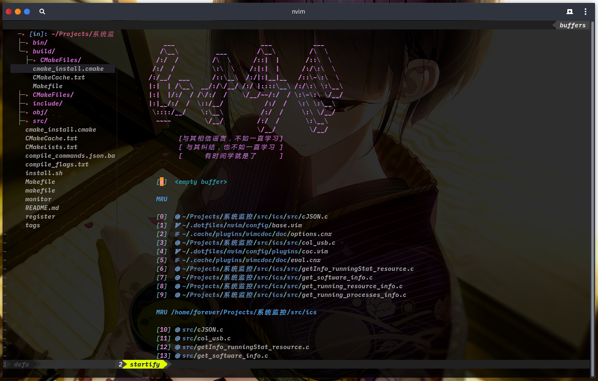

# vime




### 整体结构

```bash
├── coc-settings.json
├── config/
   ├── base.vim
   ├── keymap.vim
   ├── plugins/
   ├── plug.vim
   └── theme.vim
├── init.vim
└── vimrc -> ./init.vim
```

简单了解下整个结构，我用的插件管理器是[junegunn/*vim*-*plug*](https://github.com/junegunn/vim-plug)。

config目录下：

1. `plug.vim`文件就是`vim-plug`的插件配置文件，用于描述安装哪些插件。注释掉的插件不会加载其配置，您可以在这里组合自己需要的插件。
2. `base.vim`用于基础配置
3. `keymap.vim`用于按键映射
4. `theme.vim`用于主题配置
5. `plugins`目录下是所有插件的配置文件，一个插件一个配置文件，您可以直接复制其中的插件配置到自己的`neo/vim`配置中

### 简单了解

1. 补全使用的是[neoclide/*coc*.*nvim*](https://github.com/neoclide/coc.nvim)，不过您可以在`plug.vim`文件中注释掉`coc`然后打开`ycm`的注释来使用`ycm`补全
2. 文件管理使用的是[Shougo/*defx*.nvim](https://github.com/Shougo/defx.nvim)
3. 函数浏览器使用的是[liuchengxu/*vista*.*vim*](https://github.com/liuchengxu/vista.vim)

### 快捷键

不管您选择了哪种补全插件，哪种检索插件，我们的快捷键配置都会尽可能保持一致，无须更改您的使用习惯，改变的只是`neo/vim`表现形式。

#### 补全行为

在使用不同补全插件下，补全操作是一致的。

| 按键      | 描述                                                         |
| --------- | ------------------------------------------------------------ |
| tab       | 选择下拉框的下一个（如果存在下拉框的话）<br>显示下拉框（如果不存在下拉框的话） |
| shift-tab | 选择下拉框的上一个（如果存在下拉框的话）                     |
| enter     | 选中下拉框中的该条目（如果存在下拉框的话）                   |
| alt-j     | 跳转到下一处代码块                                           |
| alt-k     | 跳转到上一处代码块                                           |
| gd        | 跳转到定义                                                   |
| gr        | 跳转到引用                                                   |
| gi        | 跳转到实现                                                   |
| gy        | 跳转到类型定义                                               |
| space-j   | 跳转到下一处错误                                             |
| space-k   | 跳转到上一处错误                                             |
|           |                                                              |

#### 窗口与tab操作

| 按键           | 描述                                                         |
| -------------- | ------------------------------------------------------------ |
| ctrl-w-h/j/k/l | 分别在当前窗口的左/下/上/右侧打开一个新的窗口<br>并将光标移动到新的窗口 |
| ctrl-h/j/k/l   | 分别移动光标到当前窗口的左/下/上/右侧窗口                    |
| ctrl-w-o       | 最大化当前窗口，前提是在`plug.vim`中没有注释掉`zoomwintab.vim`插件 |
| F2             | 打开文件列表，关于文件列表的使用查看`config/plugins/defx.vim` |
| F3             | 打开函数列表                                                 |
| F4             | 打开撤回列表                                                 |
| F7             | 阅读模式                                                     |
| F8             | 打开/关闭悬浮终端                                            |
| F9             | 打开/关闭tab终端                                             |
| ctrl-t         | 打开/关闭底部终端                                            |
| <leader>-t-n/c | 打开/关闭一个tab                                             |
| -              | 选择窗口                                                     |
|                |                                                              |

#### buffer与文件检索操作

| 按键    | 描述                 |
| ------- | -------------------- |
| alt-h/l | 上/下一个buffer      |
| alt-r   | 最近打开的文件       |
| alt-o   | 当前打开的所有文件   |
| alt-f   | 当前工程下的所有文件 |
| alt-w   | 当前所有窗口         |
| alt-m   | 当前所有的mark       |
|         |                      |


#### 多光标

| 按键         | 描述                                                         |
| ------------ | ------------------------------------------------------------ |
| ctrl-down/up | 在当前位置下方/上方插入光标                                  |
| ctrl-a       | 选中当前光标下的所有单词，然后在每个单词处插入一个光标       |
| ctrl-n       | 在visual模式下选中内容之后，按下ctrl-n会在下一处与当前选中内一样的地方插入光标。非visual模式下，与ctrl-a表现差不多，不过是依次选择当前光标下的单词。 |
| ctrl-c       | 在任意位置插入光标                                           |
| q            | 取消当前位置插入的光标                                       |
|              |                                                              |

